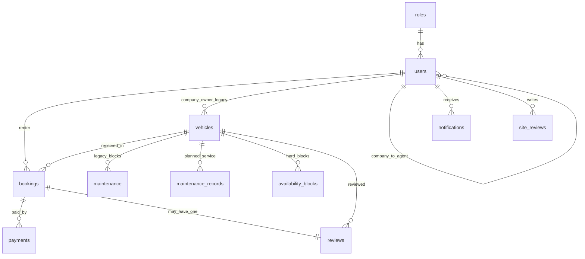
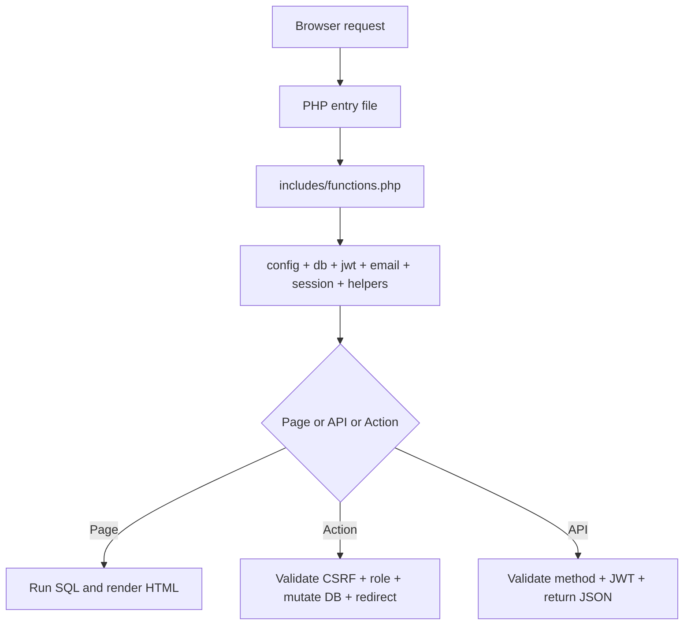
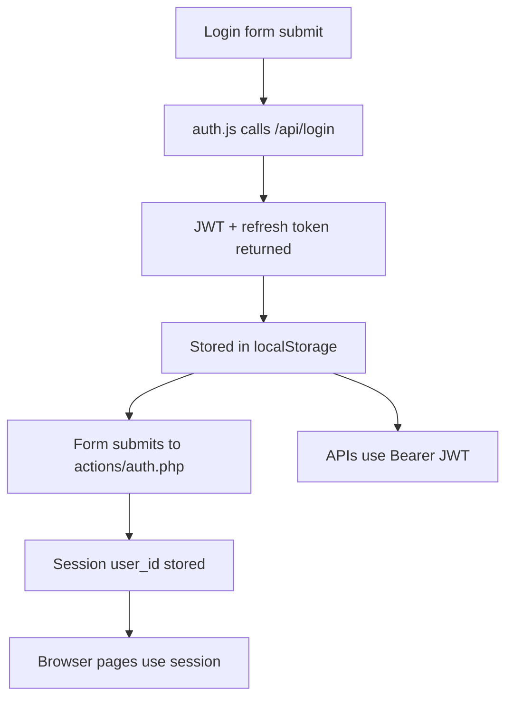
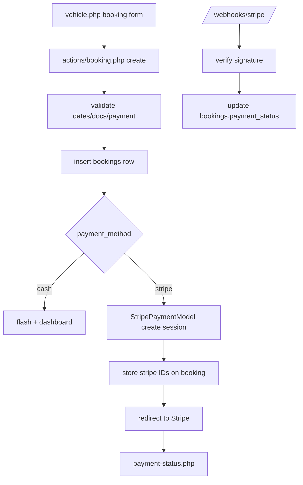

# Vehicle Rental System - Full Project Analysis

## 1. Executive Overview

### Simple explanation
This project is a university-level vehicle rental website where customers can register, verify OTP, browse vehicles, submit bookings, pay with Stripe or a mock gateway, track booking/payment status, leave reviews, receive notifications, and interact with a simple AI vehicle consultant. Companies, agents, and admins each use the same application but see different dashboard tools.

### Technical explanation
The codebase is a PHP monolith using server-rendered pages plus AJAX/JSON endpoints. It stores data in MySQL/MariaDB through PDO, uses PHP sessions for browser page access, uses a custom JWT implementation for API access, uses PHPMailer for OTP and receipt emails, Stripe Checkout for real payment flow, and Groq for the AI consultant when configured.

### Deep engineering explanation
Architecturally this is a hybrid "page controller + action handler + helper library + model-like service classes" monolith. It is not clean MVC. Instead:

- Pages such as `index.php`, `vehicle.php`, `dashboard.php`, `payments.php` render HTML.
- POST form handlers live in `actions/*.php`.
- JSON endpoints live in `api.php` and `api/*`.
- Shared logic lives in `includes/*` and `includes/helpers/*`.
- Domain-specific model/service classes live in `backend/models/*`.
- Routing/security helpers for APIs live in `backend/routes/api_common.php`.

This means the project is easy to run in XAMPP and easy to demonstrate in viva, but the tradeoff is inconsistent boundaries between page logic, business logic, and data access.

## 2. Architecture Overview

### Architecture style
- Primary style: PHP server-rendered monolith
- Request model: client-server
- Frontend style: HTML/CSS/vanilla JavaScript
- Backend style: page controllers + action handlers + JSON APIs
- Data layer: direct PDO queries, no ORM
- Auth style: dual system
  - Sessions for web pages
  - JWT + refresh tokens for APIs

### Major subsystems
- Public website: `index.php`, `vehicles.php`, `vehicle.php`
- Authentication: `login.php`, `register.php`, `verify-otp.php`, `forgot-password.php`, `reset-password.php`, `actions/auth.php`, `api/login.php`, `api/register.php`, `api/otp/verify.php`
- Dashboard: `dashboard.php` + `dashboard/*.php`
- Vehicle management: `actions/vehicle.php`, `api/vehicles.php`, helper queries in `includes/helpers/vehicle_helpers.php`
- Bookings: `actions/booking.php`, `api/bookings/index.php`, `backend/models/BookingModel.php`
- Payments: `actions/payment.php`, `payment-checkout.php`, `payment-status.php`, `payments.php`, `backend/models/StripePaymentModel.php`, `webhooks/stripe.php`
- Reviews and ratings: `actions/review.php`, `api.php?action=review_submit`, `api.php?action=site_rating_submit`
- Notifications: `actions/notification.php`, `backend/models/NotificationService.php`, `api.php?action=notifications`
- Maintenance and availability: `actions/vehicle.php`, `api/maintenance/index.php`, `backend/models/MaintenanceModel.php`, `api/vehicles/booked_dates.php`
- AI consultant / chatbot: `includes/footer.php`, `assets/js/chatbot.js`, `api/consultant/index.php`, `backend/models/VehicleConsultantModel.php`

### How all parts connect
1. Apache serves a PHP entry file.
2. Most PHP files include `includes/functions.php`.
3. That loader brings in config, database, JWT, email, sessions, and shared helper files.
4. The page either renders HTML directly or forwards to an action/API.
5. Actions mutate state and redirect.
6. APIs return JSON.
7. Shared business rules are concentrated in helper functions and model classes.

## 3. Folder Structure Breakdown

```text
vehicle-rental-system-clean/
|-- actions/                  POST form handlers for browser pages
|-- admin/                    Tiny redirect wrapper for admin users
|-- api/                      Feature-based JSON endpoints and rewrite rules
|-- assets/
|   |-- css/                  Main stylesheet
|   |-- images/               Demo vehicle and UI images
|   `-- js/                   Split browser scripts
|-- auth/                     Logout wrapper
|-- backend/
|   |-- models/               Model/service classes
|   `-- routes/               Shared API route helpers
|-- company/                  Tiny redirect wrapper for company/agent users
|-- config/                   Compatibility include for DB
|-- dashboard/                Role-specific dashboard views + partials
|-- docs/                     Research notes, testing notes, manuals, audit docs
|-- includes/                 Core bootstrap, config, db, layout, helpers
|-- payment/                  Compatibility wrapper route
|-- tests/                    CLI smoke tests
|-- user/                     Tiny redirect wrapper for end users
|-- webhooks/                 Stripe webhook entrypoint + rewrite
|-- api.php                   Legacy multipurpose API router
|-- dashboard.php             Dashboard router
|-- index.php                 Home page
|-- login.php                 Login page
|-- register.php              Registration page
|-- vehicle.php               Vehicle detail + booking page
|-- vehicles.php              Search/listing page
|-- payments.php              Payment history page
|-- payment-status.php        Payment detail/status page
|-- payment-checkout.php      Mock gateway screen
|-- vehicle-rental.sql        Intended full schema dump
`-- seed.sql                  Intended seed data
```

### Critical runtime directories
- `uploads/`: user-uploaded documents and vehicle images; required for self-drive docs and media
- `logs/`: DB and mail error logs
- `tmp/sessions/`: local session storage used for CLI testing after refactor
- `vendor/`: Composer dependencies; required for PHPMailer and Stripe

## 4. File-by-File Analysis

### Root entry pages

| File | Purpose | Imports | Used by | Criticality | What breaks if removed |
|---|---|---|---|---|---|
| `index.php` | Home page with hero search, featured vehicles, categories, site rating summary | `includes/functions.php`, `includes/header.php`, `includes/footer.php` | Public visitors | High | Landing page disappears |
| `vehicles.php` | Vehicle listing/search page | same | Public visitors, chatbot links | High | Search/listing flow breaks |
| `vehicle.php` | Single vehicle detail page, booking form, calendar, reviews, GPS | same | Links from listing/chatbot | Very high | Booking entry flow breaks |
| `login.php` | Login form page | same | Guests | Very high | Session login flow breaks |
| `register.php` | Registration form | same | Guests | Very high | Account creation breaks |
| `verify-otp.php` | OTP verification page | same | New users | Very high | Registration completion breaks |
| `forgot-password.php` | Password reset request page | same | Existing users | Medium | Password recovery flow breaks |
| `reset-password.php` | OTP-based password reset page | same | Existing users | Medium | Password reset completion breaks |
| `dashboard.php` | Router that selects role dashboard partial | same + `NotificationService` | All logged-in users | Very high | Main protected UI breaks |
| `payments.php` | Payment history page | same | Logged-in users with role-specific filtering | High | Payment review UI breaks |
| `payment-status.php` | Payment detail/status page for Stripe and mock provider | same + `StripePaymentModel` | Redirects from payment flows | Very high | Users cannot confirm payment results |
| `payment-checkout.php` | Mock Khalti-style payment simulator | same | Mock payment flow | Medium | Non-Stripe demo payment path breaks |
| `api.php` | Legacy action-based JSON router | `api_common.php`, models | JS search, API wrappers, tests | Very high | Multiple AJAX/API actions break |

### Small wrapper routes

| File | Purpose | Notes |
|---|---|---|
| `admin/index.php` | Validates admin role then redirects to `dashboard.php?section=overview` | Convenience URL only |
| `company/index.php` | Validates company/agent role then redirects to dashboard | Convenience URL only |
| `user/index.php` | Validates user role then redirects to dashboard | Convenience URL only |
| `auth/logout.php` | Clears session and browser JWT storage, redirects to login | Important because header logout points here |
| `payment/status/index.php` | Compatibility wrapper requiring `payment-status.php` | Optional but useful for cleaner route |
| `config/db.php` | Compatibility wrapper requiring `includes/db.php` | Exists to preserve older include paths |

### `includes/` bootstrap layer

| File | Purpose | Key contents |
|---|---|---|
| `includes/config.php` | Environment loading and constants | `APP_PUBLIC_URL`, DB constants, mail config, JWT config, Stripe config, Groq config, upload paths |
| `includes/db.php` | PDO access layer | `db()`, `db_all()`, `db_one()`, `db_value()`, `db_run()`, `db_log_error()` |
| `includes/jwt.php` | Custom JWT and refresh-token helpers | `make_jwt()`, `read_jwt()`, `api_token_user()`, `make_refresh_token()` |
| `includes/email.php` | PHPMailer integration and email templates | OTP, booking confirmation, cancellation, receipt emails |
| `includes/header.php` | Shared HTML head and nav bar | Base href, CSS versioning, nav visibility, notification badge |
| `includes/footer.php` | Shared footer, chatbot HTML, JS loading | Loads split scripts in order |
| `includes/auth_check.php` | Optional helper for mixed session/JWT auth | Returns user or null, does not throw |
| `includes/functions.php` | Compatibility loader for helper modules | Central include used everywhere |

### `includes/helpers/`

| File | Responsibilities | Key functions |
|---|---|---|
| `core_helpers.php` | escaping, redirects, flash, CSRF, money, dates, upload helpers | `e`, `go`, `flash`, `csrf_*`, `money`, `booking_days`, `save_upload` |
| `auth_helpers.php` | user lookup, role checks, company ownership rules | `current_user`, `require_login`, `require_role`, `managed_company_id` |
| `schema_helpers.php` | DB schema introspection and compatibility helpers | `db_table_exists`, `db_column_exists`, `db_enum_allows`, `ensure_service_history_schema` |
| `vehicle_helpers.php` | availability, filter parsing, query construction | `vehicle_unavailable_reason`, `filtered_vehicles`, `most_rented_vehicles` |
| `payment_helpers.php` | payment lookup, badges, signatures, reminders | `payment_for_booking`, `payment_badge`, `payment_webhook_signature`, `rental_reminders_for_user` |
| `review_helpers.php` | review stats, website ratings, render helpers | `vehicle_review_stats`, `site_review_stats`, `rating_html`, `user_can_review_booking` |
| `otp_helpers.php` | OTP schema normalization and OTP create/verify | `ensure_otp_schema`, `create_otp`, `verify_otp_code` |

### Why the helper split matters
Before refactor, `includes/functions.php` was a giant everything-file. It is now a loader, which makes onboarding and navigation easier without breaking old include paths.

### `actions/` browser POST handlers

| File | Role | Main branches |
|---|---|---|
| `actions/auth.php` | Registration, login, OTP, password reset, company request admin review, agent management | `register`, `login`, `verify_otp`, `resend_otp`, `forgot`, `reset_password`, `add_agent`, `update_company`, `request_company_delete`, `edit_agent`, `delete_agent`, `review_company_request`, `admin_delete_company` |
| `actions/booking.php` | Customer booking lifecycle and company/admin booking decisions | `create`, `extend`, `change_vehicle`, `cancel`, `decide`, `admin_update`, `admin_cancel` |
| `actions/payment.php` | Mock payment start/complete, Stripe retry, webhook simulation | `start`, `stripe_retry`, `complete`, `webhook` |
| `actions/vehicle.php` | Vehicle CRUD, maintenance CRUD, service history CRUD | `save`, `delete`, `maintenance`, `maintenance_delete`, `service_history`, `service_history_delete` |
| `actions/review.php` | Review submit and site rating submit | `create`, `site_rating` |
| `actions/notification.php` | Notification read state | `mark_read`, `mark_all_read` |

These files are critical because browser forms submit here, not directly to models.

### `backend/models/`

#### `BookingModel.php`
- Purpose: centralizes API-side booking validation, availability conflict checks, pricing, and response shaping
- Key methods:
  - `validateBookingInput()`: normalizes dates/payment/driver flags
  - `createForUser()`: transactional booking creation used by API
  - `availabilityConflict()`: shared conflict detection
  - `findConfirmation()`: loads enriched booking record for response/Stripe
  - `confirmationData()`: shapes API response data
- Imported by: `api/bookings/index.php`
- Why it exists: keeps API booking creation out of the giant `api.php`

#### `MaintenanceModel.php`
- Purpose: writes maintenance records and keeps `availability_blocks` and legacy `maintenance` table synchronized
- Key methods:
  - `validateInput()`
  - `save()`
  - `delete()`
  - `responseData()`
  - internal `syncAvailabilityBlock()` and `syncLegacyMaintenance()`
- Important design detail: this project has both `maintenance_records` and legacy `maintenance`. The model intentionally writes both so older page logic still works.

#### `StripePaymentModel.php`
- Purpose: Stripe Checkout and webhook processing
- Key methods:
  - `requireCheckoutConfig()`
  - `createCheckoutSession()`
  - `storeCheckoutSession()`
  - `syncCheckoutSessionStatus()`
  - `refundPaymentIntent()`
  - `verifyWebhookEvent()`
  - `handleWebhookEvent()`
- Critical runtime behavior:
  - Stores Stripe session and payment intent IDs on `bookings`
  - Treats `bookings.payment_status` as the main payment truth inside this app

#### `NotificationService.php`
- Purpose: all in-app notification writes and reads
- Important methods:
  - `notify()`, `notifyMany()`
  - `companyRecipients()`, `bookingRecipients()`
  - `notifyBookingSubmitted()`, `notifyBookingStatus()`, `notifyBookingCompleted()`
  - `unreadCount()`, `latestForUser()`, `markRead()`, `markAllRead()`

#### `VehicleConsultantModel.php`
- Purpose: rank filtered vehicles locally, then optionally ask Groq to explain the recommendations
- Pipeline:
  1. Normalize input
  2. Identify missing fields
  3. Reuse `filtered_vehicles()`
  4. Score/rank results
  5. Ask Groq if configured
  6. Fall back to local answer if Groq unavailable

### `backend/routes/api_common.php`
- Shared JSON API foundation
- Provides:
  - `api_response()`
  - `api_require_method()`
  - `api_data()`
  - `api_require_user()`
  - `api_require_company_access()`
  - `api_require_vehicle_access()`
- This file is the closest thing to middleware in the project.

### `api/` endpoints

| File | Endpoint style | Purpose |
|---|---|---|
| `api/login.php` | POST `/api/login` | Thin wrapper that sets `action=login` then loads `api.php` |
| `api/register.php` | POST `/api/register` | Thin wrapper for API registration |
| `api/otp/verify.php` | POST `/api/otp/verify` | OTP verification API |
| `api/vehicles.php` | GET/POST/PUT/DELETE `/api/vehicles` | Method-based wrapper around legacy `api.php` vehicle actions |
| `api/vehicles/booked_dates.php` | GET | Returns booking + block + maintenance ranges for availability calendar |
| `api/bookings/index.php` | POST | Proper feature endpoint for booking creation |
| `api/maintenance/index.php` | GET/POST/DELETE | Maintenance management API |
| `api/consultant/index.php` | POST | AI consultant endpoint |
| `api/.htaccess` | Apache rewrites | Enables nicer `/api/login`, `/api/bookings`, `/api/consultant` URLs |

### `webhooks/`
- `webhooks/stripe.php`: secure Stripe webhook receiver
- `webhooks/.htaccess`: exposes `/webhooks/stripe`

### `dashboard/`

| File | Purpose |
|---|---|
| `dashboard.php` | Reads current user role and selects the correct role file |
| `dashboard/user.php` | User booking/review/notification dashboard |
| `dashboard/company.php` | Company fleet, agents, revenue, requests, maintenance dashboard |
| `dashboard/agent.php` | Agent operations dashboard for vehicles, bookings, maintenance |
| `dashboard/admin.php` | Admin analytics, bookings, revenue, maintenance, site ratings, company approvals |
| `dashboard/partials/role_notifications.php` | Shared notification section for non-user roles |

### `assets/js/`

| File | Purpose |
|---|---|
| `auth.js` | Registration role toggle, password confirm check, login JWT capture, logout cleanup, OTP resend timer |
| `booking.js` | Vehicle booking form behavior, document toggling, availability calendar, total price calculation |
| `gps.js` | Mock GPS drift effect on vehicle detail page |
| `vehicle-filters.js` | Vehicle category/type dependent dropdown filtering |
| `vehicle-search.js` | AJAX live search on listing page |
| `chatbot.js` | Chatbot open/close, live availability call, Groq consultant call, card rendering |
| `app.js` | Legacy compatibility file; now only notes that logic moved into split files |

### `assets/css/style.css`
- Single large stylesheet for entire site
- Still monolithic
- Controls:
  - layout
  - cards
  - forms
  - dashboard
  - chatbot
  - calendars
  - badges
- It is important because every page uses it through the shared header.

### Docs and test files
- `tests/crud_smoke.php`: best quick safety test in repo; exercises users, OTP, vehicles, bookings, maintenance, service history
- `docs/sprint2-*.md`: developer testing notes that describe intended feature verification for JWT, chatbot, and AI consultant
- `docs/hyrox-user-manual-sprint3.md`: user-facing manual, not core runtime
- `docs/vehicle-rental-website-research.md`, `docs/wbs-chart.md`: planning/reference artifacts, optional for runtime

### SQL files
- `vehicle-rental.sql`: intended canonical schema dump
- `seed.sql`: intended demo data
- Important caveat: the runtime code and local database show schema drift. The app contains compatibility logic to survive both older and newer schemas.

### Appendix: remaining support files and why they exist

| File or group | Purpose | Critical? | Notes |
|---|---|---|---|
| `composer.json` | Declares PHP dependencies | High | Needed for `composer install` |
| `composer.lock` | Locks exact dependency versions | Medium | Important for reproducible installs |
| `.gitignore` | Prevents vendor, uploads, logs, `.env` from being committed | Medium | Protects secrets and runtime files |
| `.env.example` | Setup template for required config | High | Best starting point for new environment setup |
| `README.md` | Minimal project label only | Low | Runtime unaffected if removed |
| `assets/images/*` | Demo and display images for vehicles/branding | Medium | UI becomes less complete but app still functions |
| `tmp/sessions/*` | Local session files when custom save path is used | Low for HTTP runtime, medium for local CLI validation | Runtime artifact, not source |
| `logs/*.log` | Error diagnostics | Medium | App still runs, debugging becomes harder |
| `uploads/*` | User and vehicle file uploads | High for upload-related features | Missing write access breaks self-drive docs and image uploads |

## 5. Frontend Flow

### Startup flow for a page request
1. Browser requests a PHP page.
2. The page includes `includes/functions.php`.
3. Config loads `.env`, constants, and session.
4. Page runs its own DB queries.
5. `includes/header.php` emits HTML head, base href, nav, CSS.
6. Page body renders.
7. `includes/footer.php` emits footer, chatbot HTML, and JS files.
8. Browser executes the JS modules in this order:
   - auth
   - booking
   - gps
   - vehicle-filters
   - vehicle-search
   - chatbot

### Routing model
- No client-side router
- Every page is a real PHP endpoint
- AJAX only enhances parts of the UI

### State management
- Server state: database
- Auth state for web pages: PHP session (`$_SESSION['user_id']`)
- Auth state for APIs: JWT in browser `localStorage`
- UI state: DOM variables inside vanilla JS files

### Key frontend interactions
- Login page:
  - JS first calls `/api/login`
  - Saves JWT + refresh token to `localStorage`
  - Then resubmits the normal form to `actions/auth.php`
  - The form submission creates the PHP session
- Vehicles page:
  - Search form changes call `api.php?action=vehicles...`
  - Returned vehicles re-render the listing cards in-place
- Vehicle detail page:
  - Booking form loads blocked dates via `/api/vehicles/booked_dates.php`
  - JS disables submission when date range conflicts
- Chatbot:
  - First checks live availability through `api.php?action=vehicles`
  - Then calls `/api/consultant/index.php` for explanation

## 6. Backend Flow

### Page request lifecycle
1. Apache maps URL to PHP file.
2. PHP file includes bootstrap/helpers.
3. Session starts if needed.
4. Access control functions may redirect.
5. DB queries are executed through PDO helper functions.
6. Header, body, footer HTML is returned.

### Form POST lifecycle
1. Browser submits form to `actions/*.php`
2. Action file includes helpers/models
3. `check_csrf()` validates CSRF token
4. `require_role()` or `require_login()` validates access
5. Request branch runs based on hidden `action`
6. Data is validated
7. DB updates happen
8. Emails/notifications may trigger
9. Flash message is stored
10. User is redirected

### JSON API lifecycle
1. Frontend or external client hits `api.php` or `api/*`
2. `api_common.php` sets JSON response conventions
3. API method and auth are validated
4. `api_data()` reads JSON body or falls back to `$_POST`
5. Route logic performs DB reads/writes or model calls
6. `api_response()` returns consistent JSON

## 7. Database Flow

### Core tables actually used
- `roles`
- `users`
- `otp_codes`
- `refresh_tokens`
- `company_requests`
- `vehicle_categories`
- `vehicle_types`
- `vehicles`
- `bookings`
- `payments`
- `maintenance`
- `maintenance_records`
- `availability_blocks`
- `notifications`
- `reviews`
- `site_reviews`
- `service_history`

### Relationship map



### Important schema nuance
The code supports two company models:
- Newer model: separate `companies` table
- Older model: `users` row with role `company` owns vehicles directly

Current local runtime is using the older path. That is why helpers such as `company_table_enabled()` exist.

### Query patterns
- Most queries use prepared statements through PDO
- Many pages issue direct SQL inline
- Vehicle search uses a large assembled SQL statement with subqueries for ratings/rental count
- Dashboard pages query multiple datasets eagerly instead of paginating or lazy-loading

### Data flow example: booking create
1. User submits booking form
2. `actions/booking.php` validates vehicle/date/docs/payment method
3. `bookings` row inserted
4. If Stripe:
   - Stripe session created
   - `bookings.stripe_session_id` and `stripe_payment_intent_id` stored
5. Notification written to `notifications`
6. User redirected to Stripe or dashboard

## 8. Authentication Flow

### Web authentication
- Source of truth: PHP session
- Login handled by `actions/auth.php`
- Session field used: `$_SESSION['user_id']`
- Access checks:
  - `require_login()`
  - `require_role()`
  - `role_allowed()`

### API authentication
- Source of truth: custom JWT
- JWT creation: `make_jwt($user)`
- JWT reading: `read_jwt()`
- API user resolution: `api_token_user()`
- Protected API guard: `api_require_user()`
- Refresh token issuance: `make_refresh_token()`

### Registration and OTP
1. `actions/auth.php?action=register`
2. User row inserted with hashed password
3. OTP generated in `otp_codes`
4. Email sent via PHPMailer
5. `verify_user_id` stored in session
6. User visits OTP page
7. `verify_otp_code()` marks OTP used
8. User status becomes:
   - `active` for regular users
   - `pending_admin` or `pending` for companies

### Authorization model
- `user`: customer browsing, booking, reviewing, rating site
- `company`: manages company profile, agents, company fleet, maintenance, booking oversight
- `agent`: manages vehicles/bookings/maintenance for linked company
- `admin` / `super_admin`: platform oversight, company approvals, analytics

## 9. API Documentation

### Main routes

| Route | Method | Auth | Purpose |
|---|---|---|---|
| `/api/login` | POST | none | API login, returns JWT + refresh token |
| `/api/register` | POST | none | API register, creates user and sends OTP |
| `/api/otp/verify` | POST | none/session-assisted | API OTP verification |
| `/api/vehicles` | GET | none | List/search vehicles |
| `/api/vehicles` | POST/PUT | JWT company/agent/admin | Create/update vehicle |
| `/api/vehicles` | DELETE | JWT company/agent/admin | Delete vehicle |
| `/api/vehicles/booked_dates.php?vehicle_id=` | GET | none | Booking/maintenance/block ranges |
| `/api/bookings` | POST | JWT user | Create booking, optional Stripe session |
| `/api/maintenance` | GET/POST/DELETE | JWT company/agent/admin | Maintenance CRUD |
| `/api/consultant` | POST | none | AI recommendations |
| `/webhooks/stripe` | POST | Stripe signature | Payment webhook processing |

### Legacy `api.php` actions still in use
- `login`
- `refresh`
- `logout`
- `register`
- `vehicles`
- `vehicle_consultant`
- `vehicle_save`
- `vehicle_delete`
- `booking_decide`
- `admin_bookings`
- `revenue_summary`
- `review_submit`
- `site_rating_submit`
- `notifications`
- `notification_mark_read`

### Response format
Most JSON APIs return:

```json
{
  "success": true,
  "message": "Human readable message",
  "data": {}
}
```

## 10. Dependency Analysis

### Composer packages

| Package | Why used | Where used | Essential? | Notes |
|---|---|---|---|---|
| `phpmailer/phpmailer` | SMTP email sending | `includes/email.php` | Yes for OTP/reset/receipts | Without it registration and email features degrade |
| `stripe/stripe-php` | Stripe Checkout and webhook verification | `backend/models/StripePaymentModel.php` | Yes for Stripe grading feature | Requires `vendor/autoload.php`, cURL, secret keys |

### Native PHP features the project depends on
- PDO + `pdo_mysql`
- sessions
- `password_hash` / `password_verify`
- cURL for Groq and Stripe
- Apache mod_rewrite for pretty API/webhook URLs

### No build system
- No npm
- No bundler
- No transpiler
- No Docker
- No CI config in repo

That makes startup easy but production discipline weaker.

## 11. Environment Variables and Config

### Variables from `.env.example`

| Variable | Required? | Purpose | Breakage if missing |
|---|---|---|---|
| `APP_PUBLIC_URL` | Yes | Base URL for links, Stripe callbacks, `<base href>` | Broken relative links and wrong Stripe redirect URLs |
| `MAIL_USERNAME` | Needed for mail features | SMTP login | OTP/reset/receipt emails fail |
| `MAIL_PASSWORD` | Needed for mail features | SMTP password/app password | Same as above |
| `MAIL_FROM` | Optional fallback | From address | Uses username if missing |
| `JWT_SECRET` | Yes | Signs JWTs and mock payment webhook signatures | API auth unsafe/broken |
| `STRIPE_SECRET_KEY` | Needed for Stripe | Stripe API calls | Stripe booking path fails |
| `STRIPE_WEBHOOK_SECRET` | Needed for Stripe webhooks | Webhook verification | Webhook validation fails |
| `STRIPE_CURRENCY` | Optional | Checkout currency | Defaults to `npr` |
| `STRIPE_API_VERSION` | Optional | Stripe SDK version pin | Defaults provided |
| `AI_CONSULTANT_NAME` | Optional | Branding for consultant | Cosmetic |
| `GROQ_API_KEY` | Optional | AI request auth | Consultant falls back locally |
| `GROQ_MODEL` | Optional | Groq model name | Defaults provided |
| `GROQ_API_URL` | Optional | Groq endpoint | Defaults provided |

### Important local-security note
The local `.env` currently contains real-looking email credentials. Even if `.env` is gitignored, these secrets should be rotated if they were ever shared.

## 12. Security Analysis

### What is done reasonably well
- Passwords use `password_hash()` / `password_verify()`
- Most SQL uses prepared statements
- HTML output is escaped through `e()`
- Browser form handlers use CSRF tokens
- Stripe webhooks verify signature
- Role checks are centralized enough to be reusable

### Key weaknesses
- JWT implementation is custom, minimal, and lacks issuer/audience/not-before handling
- JWT is stored in `localStorage`, which is more exposed to XSS than HttpOnly cookies
- Dual auth system increases complexity and debugging risk
- JSON APIs mostly do not use CSRF because they rely on JWT, but session-assisted API helpers could become confusing
- Some error messages expose internal reasons directly to users
- No rate limiting for login, OTP, consultant, or search APIs
- OTP resend throttling exists, but broader abuse protection does not
- `.env` secret hygiene is a concern

### Specific vulnerability risk review
- SQL injection: low to medium; most values parameterized, dynamic identifiers sanitized in schema helpers
- XSS: low to medium; server HTML is escaped, chatbot uses `innerHTML` but escapes text first
- CSRF: low for forms, mixed for APIs if session-based usage grows
- Authorization drift: medium; some logic is helper-based, but old and new flows coexist
- Business logic abuse: medium; no strict upload MIME validation beyond extension, no rate limits

## 13. Performance Analysis

### Current slow spots
- `filtered_vehicles()` uses multiple correlated subqueries for every vehicle row
- Dashboard pages eagerly load many datasets for one request
- Some counts are computed in PHP loops after full row fetches instead of SQL aggregates
- No pagination on large admin/company tables
- `current_user()` can trigger repeat DB lookups through helper calls
- `filemtime()` runs for assets on every page render

### Scaling concerns
- Works fine for a university demo or small traffic
- Will struggle with large booking history, many vehicles, or heavy concurrent users
- AI and Stripe external calls are synchronous in request path

### Good-enough choices for this project
- PDO direct queries keep the system simple to explain
- No frontend framework means very low client complexity
- Split JS and dashboard files now improve maintainability more than raw performance

## 14. Deployment Analysis

### Current deployment style
- Best fit: local XAMPP / Apache / MariaDB deployment
- Startup sequence:
  1. Start Apache
  2. Start MySQL/MariaDB
  3. Put project under `htdocs`
  4. Set `.env`
  5. Run `composer install`
  6. Import SQL / seed if needed

### Production readiness status
- Not production hardened
- No Docker or reproducible deployment scripts
- No migrations framework
- No queue for emails/webhooks/AI tasks
- No centralized logging/monitoring
- No CI/CD

### Current local known-good status
- Apache is running
- MySQL is running
- Site opens at `http://localhost/vehicle-rental-system-clean/`
- Demo login `user@test.com / password123` works
- CRUD smoke test passes
- Local DB was upgraded during refactor to add missing `maintenance_records.start_date` and `end_date`

## 15. Architecture Diagrams

### Request flow



### Authentication flow



### Booking and Stripe flow



## 16. Most Important Files to Learn First

1. `includes/functions.php` and `includes/helpers/*`
   - This is the real bootstrap and common language of the app.
2. `dashboard.php` and `dashboard/*.php`
   - This is where role-based behavior becomes visible.
3. `actions/auth.php`
   - Auth, OTP, company approval, and agent management are centralized here.
4. `actions/booking.php`
   - Booking, extension, cancellation, switching, and admin updates all meet here.
5. `api.php`
   - Legacy AJAX/API brain still powers search, notifications, reviews, and summaries.
6. `backend/models/BookingModel.php`
   - Best example of cleaner business logic extraction.
7. `backend/models/MaintenanceModel.php`
   - Important because it bridges legacy and new schema behavior.
8. `backend/models/StripePaymentModel.php`
   - Central payment integration logic.
9. `assets/js/booking.js`, `vehicle-search.js`, `chatbot.js`
   - Main frontend interaction layer.

## 17. Strengths, Weaknesses, and Architectural Truths

### Biggest strengths
- Easy local setup
- Mostly readable SQL
- Real feature breadth for a student project
- Shared helper layer keeps many features working together
- Role-based dashboards are now easier to navigate after refactor
- Supports both browser pages and API testing

### Biggest weaknesses
- Architecture is hybrid and inconsistent
- Legacy `api.php` still mixes many unrelated responsibilities
- Schema drift exists between SQL dumps and runtime DB
- Session auth and JWT auth overlap
- Large dashboard files still contain a lot of inline query/render logic
- CSS is still one large monolith

### Messiest architectural area
- Company and company-table compatibility
- Payment split between mock gateway and Stripe
- Old monolith route style plus new feature folders

### Easiest architectural area
- Public pages and basic page rendering
- Helper-based escaping, redirect, flash, and DB utilities

## 18. Recommendations

### Safe, student-friendly next refactors
- Split `actions/auth.php` into smaller auth/company/admin action files
- Split `api.php` into real feature files and keep `api.php` as a fallback router
- Split `assets/css/style.css` into page/feature CSS files
- Move repeated dashboard query blocks into small dashboard data helpers
- Add simple pagination to admin/company tables
- Add one schema-check/setup script for local environments

### Security improvements
- Move JWT from `localStorage` to secure cookie if API design allows
- Add rate limiting or brute-force throttling around login and OTP
- Rotate local mail credentials
- Add file MIME validation in addition to extension checks

### Performance improvements
- Replace some per-row rating/count subqueries with joined aggregates
- Cache category/type lists where practical
- Load some dashboard tabs lazily through APIs instead of all-at-once page loads

## 19. Final Summary

This system is a pragmatic university monolith. It is not elegant enterprise software, but it is a real multi-role rental platform with authentication, booking logic, availability checks, payments, reviews, notifications, maintenance, analytics, and AI assistance.

The app begins in Apache with a PHP page/action/API request. Almost every path flows through `includes/functions.php`, which loads config, DB, session, JWT, email, and helper functions. Pages render HTML. `actions/*.php` mutate state and redirect. `api.php` and `api/*` return JSON. The database is the center of truth, with `users`, `vehicles`, `bookings`, `payments`, `maintenance_records`, `notifications`, and reviews carrying most business state.

The codebase is now easier to explain because:
- shared helpers are split
- dashboards are role-separated
- browser JS is split by feature

The biggest remaining architectural reality is that this project still contains legacy and newer patterns at the same time. That is not a failure; it is the normal shape of a student project that kept growing. The right way to maintain it is not to rewrite everything at once, but to keep doing safe extractions like the ones already started here.
