# Sprint 3 WBS Chart - Vehicle Rental System

> Jira connector is not available in this Codex workspace, so this compact WBS is based on the local Sprint 3-related project work found in the codebase.

## Compact WBS Chart

```mermaid
flowchart TD
    A["1.0 Sprint 3: Maintenance and Fleet Service Updates"]

    A --> B["1.1 Maintenance Management"]
    B --> B1["1.1.1 Add maintenance records"]
    B --> B2["1.1.2 Validate maintenance data"]
    B --> B3["1.1.3 Block vehicle availability during maintenance"]

    A --> C["1.2 Service History"]
    C --> C1["1.2.1 Add service history form"]
    C --> C2["1.2.2 Save service records"]
    C --> C3["1.2.3 Delete service records"]
    C --> C4["1.2.4 Show service history by vehicle/company"]

    A --> D["1.3 Dashboard Updates"]
    D --> D1["1.3.1 Company dashboard service history"]
    D --> D2["1.3.2 Agent dashboard service history"]
    D --> D3["1.3.3 Admin dashboard service overview"]

    A --> E["1.4 Database and Access Control"]
    E --> E1["1.4.1 Create service_history table"]
    E --> E2["1.4.2 Add service history indexes"]
    E --> E3["1.4.3 Restrict records by company/user role"]

    A --> F["1.5 Testing and Documentation"]
    F --> F1["1.5.1 Update CRUD smoke test"]
    F --> F2["1.5.2 Test dashboard workflows"]
    F --> F3["1.5.3 Prepare Sprint 3 WBS/documentation"]
```

## Numbered WBS

| Code | Sprint 3 Work Package | Deliverable |
|---|---|---|
| 1.0 | Sprint 3: Maintenance and Fleet Service Updates | Completed Sprint 3 feature set |
| 1.1 | Maintenance Management | Maintenance records with validation and availability blocking |
| 1.2 | Service History | Add, view, and delete service records |
| 1.3 | Dashboard Updates | Service history shown in company, agent, and admin dashboards |
| 1.4 | Database and Access Control | `service_history` table, indexes, and role/company restrictions |
| 1.5 | Testing and Documentation | CRUD smoke test updates and Sprint 3 documentation |

